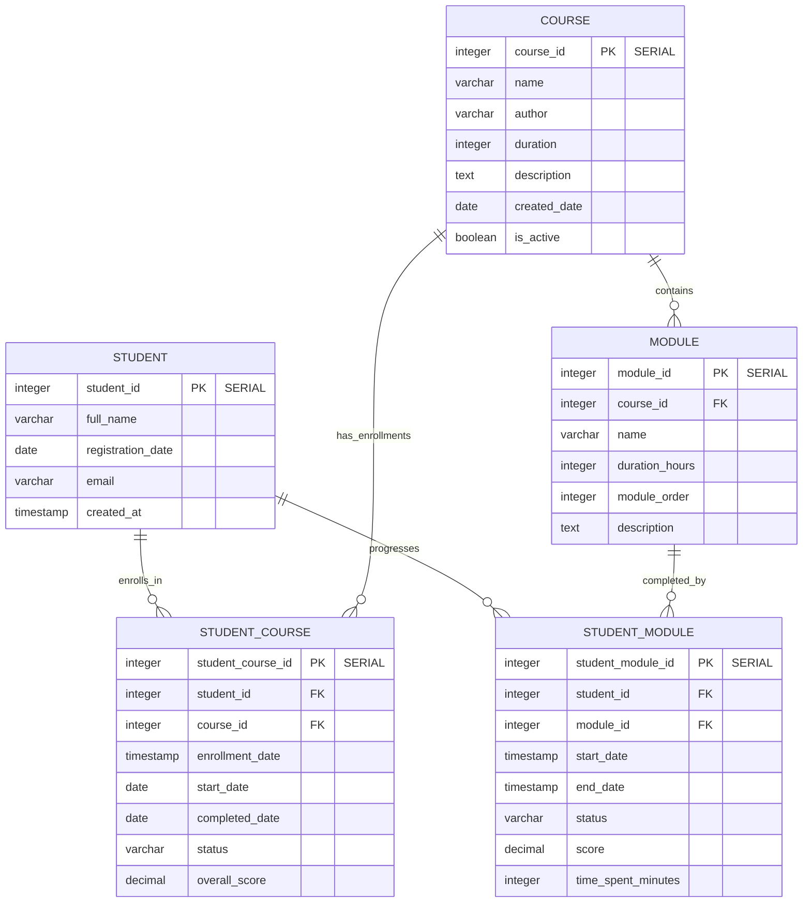
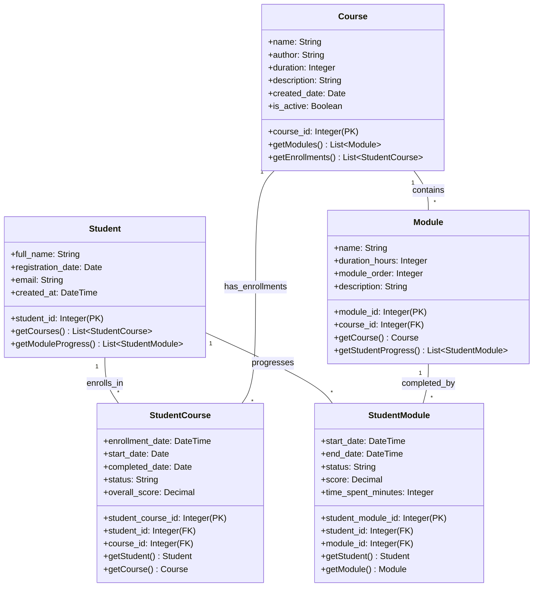
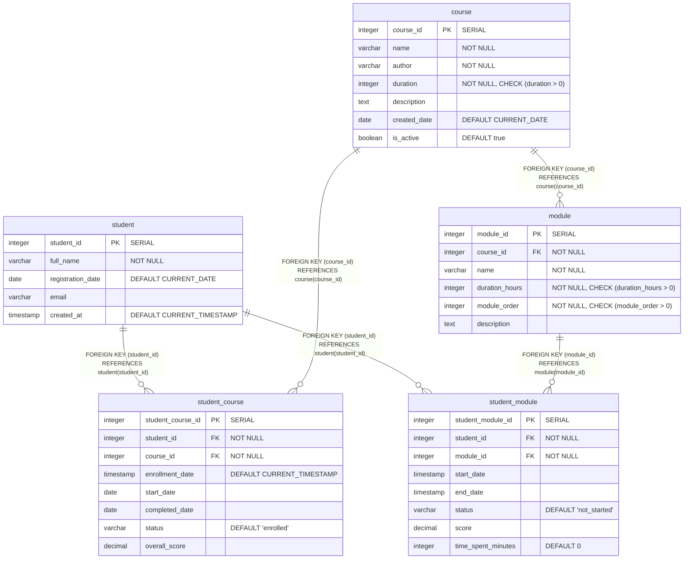

**Лабораторные работы по БД**

Перечень [лабораторные работы](https://edu.irnok.net/lib/exe/fetch.php?media=db:%D0%B2%D0%B0%D1%80%D0%B8%D0%B0%D0%BD%D1%82%D1%8B_%D0%B7%D0%B0%D0%B4%D0%B0%D0%BD%D0%B8%D0%B9_%D0%BF%D0%BE_%D1%83%D0%B4.pdf)

Telegram: [at]Шурик

# Постановка задачи (вариант 35)

**Платформа для обучения и онлайн-курсов**

*Сущности:* Курсы (наименование, автор, продолжительность), студенты (ID, ФИО, дата регистрации), модули курса (наименование, продолжительность в часах).

*Процессы:* Студенты работают над курсами, проходят модули и проводят тесты. Фиксируется дата начала и окончания прохождения каждого модуля.

*Выходные документы:*

  - Для заданного курса выдайте список студентов, прошедших более половины модулей, отсортированный по проценту выполнения (по убыванию).
  - Выдать среднее время прохождения каждого модуля для указанного курса, отсортированное по наименованию модуля.

# Лабораторная работа 1 (Проектирование логической и физической модели БД)


## Промпт к Дипсик

```text
Лаба по проектированию информационной модели для реляционных баз данных.
Предполагаем Postgresql.
Есть ошибки, замечания, неточности?

# Платформа для обучения и онлайн-курсов

## Постановка задачи

*Сущности:*
    Курсы (наименование, автор, продолжительность),
    Студенты (ID, ФИО, дата_регистрации), 
    Модули_курса (наименование, продолжительность_в_часах).

*Процессы:* 
    Студенты работают над курсами, проходят модули и проводят тесты. 
    Фиксируется дата начала и окончания прохождения каждого модуля.

*Выходные документы:*

  - Для заданного курса выдайте список студентов, прошедших более половины модулей, отсортированный по проценту выполнения (по убыванию).

  - Выдать среднее время прохождения каждого модуля для указанного курса, отсортированное по наименованию модуля.

## ER-Модель
### Базовые сущности

    Студент(ФИО, дата_регистрации), ключ - ID
    Курс(наименование, автор, продолжительность), ключ - ID  
    Модуль(наименование, продолжительность_в_часах), ключ - ID

### Отношения

    [Курс]-1,Required------------------N,Optional-[Модуль]

    [Студент]-N,Required-----Прохождение------M,Required-[Курс]
                              дата_начала, дата_окончания

    [Студент]-N,Required-----Прогресс_модуля------M,Required-[Модуль]
                              дата_начала, дата_окончания, статус

## Логическая модель

Используя правила преобразования ER-диаграмм получаем пять *таблиц*:

  - ```Student(student_id, full_name, registration_date)```, primary key - student_id
  - ```Course(course_id, name, author, duration)```, primary key - course_id
  - ```Module(module_id, course_id, name, duration_hours)```, primary key - module_id
  - ```StudentCourse(student_id, course_id, start_date, end_date)```, composite primary key - (student_id, course_id)
  - ```StudentModule(student_id, module_id, start_date, end_date, status)```, composite primary key - (student_id, module_id)

## Физическая модель

Зададим типы данных для атрибутов:

  - ```student_id::SERIAL```
  - ```full_name::varchar(100)```
  - ```registration_date::date```
  - ```course_id::SERIAL```
  - ```name::varchar(100)```
  - ```author::varchar(100)```
  - ```duration::integer``` (в часах)
  - ```module_id::SERIAL```
  - ```duration_hours::integer```
  - ```start_date::date```
  - ```end_date::date```
  - ```status::varchar(20)```

## Проверка нормальных форм

### Первая нормальная форма
Все значения всех атрибутов атомарные.

### Вторая нормальная форма
Выполняется: нет зависимостей неключевых атрибутов от части ключа

### Третья нормальная форма
Нет транзитивных зависимостей неключей от неключей

### Нормальная форма Бойса-Кодда
Соблюдена.
```

Отличная работа! Модель хорошо структурирована, но есть несколько важных замечаний и улучшений для создания более надежной базы данных.

### Критические замечания и рекомендации

#### 1. Отсутствие связи между Module и Course
**Проблема:** В текущей модели нет явной связи между модулями и курсами, что делает невозможным определение того, к какому курсу принадлежит модуль.
*   **Целостность данных:** Невозможно гарантировать, что модуль принадлежит существующему курсу.
*   **Запросы:** Невозможно выполнить требуемые запросы без связи между таблицами.

**Исправление:**
```sql
-- Было: Module(module_id, name, duration_hours)
-- Стало:
Module(
    module_id SERIAL PRIMARY KEY,
    course_id INTEGER NOT NULL REFERENCES Course(course_id) ON DELETE CASCADE,
    name VARCHAR(100) NOT NULL,
    duration_hours INTEGER NOT NULL CHECK (duration_hours > 0),
    module_order INTEGER -- Порядок модулей в курсе
);
```

#### 2. Первичные ключи для связующих таблиц
**Проблема:** Использование составных первичных ключей может быть ограничивающим.
*   **Гибкость:** Суррогатные ключи дают больше гибкости для будущих изменений.
*   **Производительность:** Внешние ключи на суррогатные ключи обычно работают лучше.

**Исправление:**
```sql
-- Было: StudentCourse(student_id, course_id, start_date, end_date)
-- Стало:
StudentCourse(
    student_course_id SERIAL PRIMARY KEY,
    student_id INTEGER NOT NULL REFERENCES Student(student_id) ON DELETE CASCADE,
    course_id INTEGER NOT NULL REFERENCES Course(course_id) ON DELETE CASCADE,
    start_date DATE NOT NULL,
    end_date DATE,
    enrollment_date TIMESTAMP DEFAULT CURRENT_TIMESTAMP,
    UNIQUE(student_id, course_id)
);

-- Было: StudentModule(student_id, module_id, start_date, end_date, status)
-- Стало:
StudentModule(
    student_module_id SERIAL PRIMARY KEY,
    student_id INTEGER NOT NULL REFERENCES Student(student_id) ON DELETE CASCADE,
    module_id INTEGER NOT NULL REFERENCES Module(module_id) ON DELETE CASCADE,
    start_date TIMESTAMP,
    end_date TIMESTAMP,
    status VARCHAR(20) DEFAULT 'not_started' CHECK (status IN ('not_started', 'in_progress', 'completed', 'failed')),
    score DECIMAL(5,2),
    UNIQUE(student_id, module_id)
);
```

#### 3. Улучшение типов данных и ограничений
**Проблема:** Некоторые типы данных можно улучшить для большей точности и гибкости.
*   **Даты:** Для точного учета времени прохождения лучше использовать TIMESTAMP
*   **Статусы:** Добавить CHECK ограничения для валидации статусов
*   **Оценки:** Добавить поле для хранения результатов тестов

**Исправление:**
```sql
-- Добавляем CHECK constraints и улучшаем типы
CREATE TABLE StudentModule (
    student_module_id SERIAL PRIMARY KEY,
    student_id INTEGER NOT NULL REFERENCES Student(student_id) ON DELETE CASCADE,
    module_id INTEGER NOT NULL REFERENCES Module(module_id) ON DELETE CASCADE,
    start_date TIMESTAMP,
    end_date TIMESTAMP,
    status VARCHAR(20) DEFAULT 'not_started' CHECK (status IN ('not_started', 'in_progress', 'completed', 'failed')),
    score DECIMAL(5,2) CHECK (score >= 0 AND score <= 100),
    time_spent_minutes INTEGER DEFAULT 0,
    UNIQUE(student_id, module_id)
);
```

---

### Исправленная и улучшенная модель

#### Логическая модель
*   **`Student`** (`student_id`, full_name, registration_date)
*   **`Course`** (`course_id`, name, author, duration, created_date)
*   **`Module`** (`module_id`, `course_id`, name, duration_hours, module_order)
*   **`StudentCourse`** (`student_course_id`, `student_id`, `course_id`, start_date, end_date, enrollment_date)
*   **`StudentModule`** (`student_module_id`, `student_id`, `module_id`, start_date, end_date, status, score, time_spent_minutes)

#### Физическая модель (DDL для PostgreSQL)
```sql
CREATE TABLE Student (
    student_id SERIAL PRIMARY KEY,
    full_name VARCHAR(100) NOT NULL,
    registration_date DATE NOT NULL DEFAULT CURRENT_DATE,
    email VARCHAR(100) UNIQUE,
    created_at TIMESTAMP DEFAULT CURRENT_TIMESTAMP
);

CREATE TABLE Course (
    course_id SERIAL PRIMARY KEY,
    name VARCHAR(100) NOT NULL,
    author VARCHAR(100) NOT NULL,
    duration INTEGER NOT NULL CHECK (duration > 0), -- в часах
    description TEXT,
    created_date DATE DEFAULT CURRENT_DATE,
    is_active BOOLEAN DEFAULT true
);

CREATE TABLE Module (
    module_id SERIAL PRIMARY KEY,
    course_id INTEGER NOT NULL REFERENCES Course(course_id) ON DELETE CASCADE,
    name VARCHAR(100) NOT NULL,
    duration_hours INTEGER NOT NULL CHECK (duration_hours > 0),
    module_order INTEGER NOT NULL CHECK (module_order > 0),
    description TEXT,
    UNIQUE(course_id, module_order)
);

CREATE TABLE StudentCourse (
    student_course_id SERIAL PRIMARY KEY,
    student_id INTEGER NOT NULL REFERENCES Student(student_id) ON DELETE CASCADE,
    course_id INTEGER NOT NULL REFERENCES Course(course_id) ON DELETE CASCADE,
    start_date DATE NOT NULL DEFAULT CURRENT_DATE,
    end_date DATE,
    enrollment_date TIMESTAMP DEFAULT CURRENT_TIMESTAMP,
    status VARCHAR(20) DEFAULT 'active' CHECK (status IN ('active', 'completed', 'dropped')),
    UNIQUE(student_id, course_id)
);

CREATE TABLE StudentModule (
    student_module_id SERIAL PRIMARY KEY,
    student_id INTEGER NOT NULL REFERENCES Student(student_id) ON DELETE CASCADE,
    module_id INTEGER NOT NULL REFERENCES Module(module_id) ON DELETE CASCADE,
    start_date TIMESTAMP,
    end_date TIMESTAMP,
    status VARCHAR(20) DEFAULT 'not_started' CHECK (status IN ('not_started', 'in_progress', 'completed', 'failed')),
    score DECIMAL(5,2) CHECK (score >= 0 AND score <= 100),
    time_spent_minutes INTEGER DEFAULT 0 CHECK (time_spent_minutes >= 0),
    UNIQUE(student_id, module_id)
);

-- Индексы для ускорения часто используемых запросов
CREATE INDEX idx_module_course ON Module(course_id);
CREATE INDEX idx_student_course_student ON StudentCourse(student_id);
CREATE INDEX idx_student_course_course ON StudentCourse(course_id);
CREATE INDEX idx_student_module_student ON StudentModule(student_id);
CREATE INDEX idx_student_module_module ON StudentModule(module_id);
CREATE INDEX idx_student_module_status ON StudentModule(status);
CREATE INDEX idx_student_module_dates ON StudentModule(start_date, end_date);
```

#### Проверка нормальных форм (для исправленной модели)
*   **1NF:** Соблюдена.
*   **2NF:** Соблюдена, так как все неключевые атрибуты полностью зависят от целого первичного ключа.
*   **3NF/BCNF:** Соблюдена. Нет транзитивных зависимостей.

---

### Примеры запросов для "Выходных документов"

**1. Список студентов, прошедших более половины модулей для заданного курса:**
```sql
WITH CourseModules AS (
    SELECT course_id, COUNT(*) as total_modules
    FROM Module 
    WHERE course_id = 1  -- ID заданного курса
    GROUP BY course_id
),
StudentProgress AS (
    SELECT 
        sc.student_id,
        s.full_name,
        COUNT(DISTINCT sm.module_id) as completed_modules,
        cm.total_modules,
        ROUND(COUNT(DISTINCT sm.module_id) * 100.0 / cm.total_modules, 2) as completion_percent
    FROM StudentCourse sc
    JOIN Student s ON sc.student_id = s.student_id
    JOIN CourseModules cm ON sc.course_id = cm.course_id
    LEFT JOIN StudentModule sm ON sc.student_id = sm.student_id 
        AND sm.status = 'completed'
        AND sm.module_id IN (SELECT module_id FROM Module WHERE course_id = 1)
    WHERE sc.course_id = 1
    GROUP BY sc.student_id, s.full_name, cm.total_modules
)
SELECT 
    student_id,
    full_name,
    completed_modules,
    total_modules,
    completion_percent
FROM StudentProgress
WHERE completion_percent > 50
ORDER BY completion_percent DESC;
```

**2. Среднее время прохождения каждого модуля для указанного курса:**
```sql
SELECT 
    m.module_id,
    m.name as module_name,
    m.duration_hours as planned_duration,
    COUNT(sm.student_module_id) as students_completed,
    ROUND(AVG(EXTRACT(EPOCH FROM (sm.end_date - sm.start_date)) / 3600), 2) as avg_hours_taken,
    ROUND(AVG(sm.time_spent_minutes) / 60, 2) as avg_hours_spent
FROM Module m
LEFT JOIN StudentModule sm ON m.module_id = sm.module_id 
    AND sm.status = 'completed'
    AND sm.end_date IS NOT NULL 
    AND sm.start_date IS NOT NULL
WHERE m.course_id = 1  -- ID заданного курса
GROUP BY m.module_id, m.name, m.duration_hours
ORDER BY m.name;
```

**Итог:** После внесения этих правок ваша модель станет более надежной и соответствующей стандартам реляционного проектирования. Удачи в сдаче лабы!

## Промпт 2

```text
В модели добавлена таблица StudentCourse, но прогресс отслеживается на уровне модулей через StudentModule.
Не является ли таблица StudentCourse избыточной? Можно ли определить прогресс по курсу только на основе пройденных модулей?
```

**Отличный вопрос! Вы правы, это важный аспект проектирования.**

### Анализ требования

Давайте рассмотрим два подхода:

#### Подход 1: Сохранить обе таблицы (текущий)
- **StudentCourse:** Общая информация о зачислении на курс
- **StudentModule:** Детальный прогресс по модулям
- **Плюсы:** Разделение ответственности, возможность хранить метаданные зачисления
- **Минусы:** Некоторая избыточность

#### Подход 2: Убрать StudentCourse
- **Только StudentModule:** Весь прогресс через модули
- **Плюсы:** Проще структура, меньше избыточности
- **Минусы:** Сложнее получить общую информацию о зачислении

### Рекомендация

**Сохранить обе таблицы**, потому что:

1. **Метаданные зачисления:** Дата начала курса, статус зачисления, дата окончания
2. **Производительность:** Быстрый доступ к общей информации о курсе без агрегации модулей
3. **Гибкость:** Студент может быть зачислен на курс, но еще не начать модули
4. **Бизнес-логика:** Разные статусы для курса и модулей

### Улучшенная модель:

```sql
-- StudentCourse хранит общую информацию о зачислении
CREATE TABLE StudentCourse (
    student_course_id SERIAL PRIMARY KEY,
    student_id INTEGER NOT NULL REFERENCES Student(student_id),
    course_id INTEGER NOT NULL REFERENCES Course(course_id),
    enrollment_date TIMESTAMP DEFAULT CURRENT_TIMESTAMP,
    start_date DATE, -- Когда студент планирует начать
    completed_date DATE, -- Когда завершил весь курс
    status VARCHAR(20) DEFAULT 'enrolled' CHECK (status IN ('enrolled', 'in_progress', 'completed', 'dropped')),
    overall_score DECIMAL(5,2),
    UNIQUE(student_id, course_id)
);

-- StudentModule хранит детальный прогресс
CREATE TABLE StudentModule (
    student_module_id SERIAL PRIMARY KEY,
    student_id INTEGER NOT NULL REFERENCES Student(student_id),
    module_id INTEGER NOT NULL REFERENCES Module(module_id),
    -- Детальная информация о прохождении модуля
    UNIQUE(student_id, module_id)
);
```

### Когда можно убрать StudentCourse?

Только если:
- Не нужна отдельная информация о зачислении на курс
- Весь прогресс определяется исключительно по модулям
- Нет отдельных статусов для курса и модулей

**Вывод:** Для полнофункциональной платформы обучения лучше сохранить обе таблицы. Это дает большую гибкость и производительность.

## Полученные диаграммы:
### ER-диаграмма



## Логическая модель в виде Диаграммы классов UML-2.4



## Физическая модель БД



## Заключение

В первой лабораторной работе при помощи теоретического инструментария проектирования БД и большой языковой модели "Дипсик" произведено проектирование ER-, логической и физической модели базы данных варианта 35. Основные замечания, решенные в ходе выполнения лабораторной работы:

  1. Реализовано две итерации консультации с БЯМ;
  2. БЯМ исправила существенные ошибки проектирования (отсутствие связи модулей с курсами, суррогатные ключи);
  3. Добавлены CHECK-ограничения для валидации статусов и числовых значений;
  4. Улучшена структура данных (TIMESTAMP для точного учета времени, порядок модулей);
  5. Сохранена оптимальная нормализация с разделением информации о зачислении и прогрессе модулей.

Ссылка на чат: https://chat.deepseek.com/a/chat/s/091b1f15-05a9-4246-a772-6637278e27d9


# Лабораторная работа 2
# 1. Логическая модель данных
# Сущности и связи:
## Сущности и связи системы "Успеваемость учеников":
1. Ученик (Students) - Основная сущность - хранит информацию об учениках (Уникальный идентификатор ученика, Фамилия ученика, Имя ученика, Адрес проживания, Контактный телефон, ФИО матери, ФИО отца), 2. Предмет (Subjects) - Хранит информацию об учебных предметах (Уникальный идентификатор предмета, Название предмета (уникальное)), 3. Успеваемость (Grades/Attendance) - Связующая таблица между учениками и предметами, хранит оценки и посещаемость (Уникальный идентификатор записи, Ссылка на ученика (FK), Ссылка на предмет (FK), Оценка (от 1 до 5), Дата выставления оценки/пропуска, Флаг пропуска занятия)
## Связи между таблицами:
1. Ученик (1) ----- (М) Успеваемость
Один ученик может иметь множество записей об успеваемости
2. Предмет (1) ----- (М) Успеваемость
Один предмет может иметь множество записей об успеваемости разных учеников
3. Успеваемость (М) ---- (1) Ученик
Каждая запись об успеваемости принадлежит одному ученику
4. Успеваемость (М) ---- (1) Предмет
Каждая запись об успеваемости относится к одному предмету
Бизнес-правила:
• Каждый ученик изучает несколько предметов
• По каждому предмету ученик получает оценки и может иметь пропуски
• Одна оценка/отметка о пропуске ставится по конкретному предмету в конкретный день
• Система отслеживает успеваемость (оценки) и посещаемость (пропуски)

## 2. Создание таблиц

## Создание таблицы Student


## Создание таблицы Course


## Создание таблицы Module


## Создаем таблицу StudentCourse


## Создаем таблицу StudentModule


# 3. Наполнение таблиц
## Вставка данных в таблицу Student


## Вставка данных в таблицу Course


## Вставка данных в таблицу Module
### Добавляем модули для курса "Основы программирования на Python


### Добавляем модули для курса "Web-разработка с Django


## Записываем студентов на курсы


## Заполняем прогресс по модулям


# 4. Содержательные SELECT-запросы с JOIN
## 1.Для заданного курса выдайте список студентов, прошедших более половины модулей, отсортированный по проценту выполнения (по убыванию).


## 2.Выдать среднее время прохождения каждого модуля для указанного курса, отсортированное по наименованию модуля.


# Лабораторная работа 3
## Представления и процедуры
### Создано VIEW для запроса
### Студенты, прошедшие >50% модулей


### Создана функция get_student_completion_report
###  Отчёт по студентам (для любого курса)


### Созданы процедуры для редактирования
```sql
CREATE OR REPLACE PROCEDURE remizova.insert_student_module(
    p_student_id INT,
    p_module_id INT,
    p_status VARCHAR,
    p_start_date TIMESTAMP,
    p_end_date TIMESTAMP DEFAULT NULL,
    p_score INT DEFAULT NULL
)
LANGUAGE plpgsql
AS $$
BEGIN
    IF EXISTS (SELECT 1 FROM remizova.studentmodule 
               WHERE student_id = p_student_id AND module_id = p_module_id) THEN
        RAISE EXCEPTION 'Запись уже существует';
    END IF;

    INSERT INTO remizova.studentmodule (student_id, module_id, status, start_date, end_date, score)
    VALUES (p_student_id, p_module_id, p_status, p_start_date, p_end_date, p_score);
END;
$$;
CREATE OR REPLACE PROCEDURE remizova.update_student_module(
    p_student_id INT,
    p_module_id INT,
    p_status VARCHAR,
    p_end_date TIMESTAMP,
    p_score INT
)
LANGUAGE plpgsql
AS $$
BEGIN
    IF NOT EXISTS (SELECT 1 FROM remizova.studentmodule 
                   WHERE student_id = p_student_id AND module_id = p_module_id) THEN
        RAISE EXCEPTION 'Запись не найдена';
    END IF;

    UPDATE remizova.studentmodule
    SET status = p_status, end_date = p_end_date, score = p_score
    WHERE student_id = p_student_id AND module_id = p_module_id;
END;
$$;
CREATE OR REPLACE PROCEDURE remizova.delete_student_module(
    p_student_id INT,
    p_module_id INT
)
LANGUAGE plpgsql
AS $$
BEGIN
    IF NOT EXISTS (SELECT 1 FROM remizova.studentmodule 
                   WHERE student_id = p_student_id AND module_id = p_module_id) THEN
        RAISE EXCEPTION 'Запись не найдена';
    END IF;

    DELETE FROM remizova.studentmodule
    WHERE student_id = p_student_id AND module_id = p_module_id;
END;
$$;
```

## Проверка


# Лабораторная работа 4
## Создание генератора данных (20 000 записей в каждой таблице)

###  Генератор студентов (student) 


### Генератор курсов (course)


###  Генератор модулей (module) 


### Запись студентов на курсы (studentcourse)


### Прогресс по модулям (studentmodule)


### Запускаем EXPLAIN ANALYZE

### Результат


### Оптимизируем БД при помощи индексов

### Обновим статистику и посмотрим, что изменилось


До оптимизации время выполнения запроса составляло 0.316 мс, а время планирования — 0.561 мс.
После оптимизации время выполнения сократилось до 0.156 мс, а время планирования — до 0.244 мс.
Общее время обработки запроса (планирование + выполнение) уменьшилось с 0.877 мс до 0.400 мс, то есть более чем в 2 раза.
Кроме того, объём используемых буферов сократился с 35 до 3, что свидетельствует о более эффективном использовании памяти.


#Лабораторная работа 5. Триггеры и аудит
##Цель: Реализация бизнес-логики на уровне БД и системы аудита.

##1. Триггеры каскадного удаления для связей "один-ко-многим"

1.1 Триггер для удаления записей из StudentModule при удалении студента


1.2 Триггер для удаления записей из StudentCourse при удалении студента


1.3 Триггер для удаления записей из StudentModule при удалении модуля


## 2. Создание таблицы-журнала для отслеживания изменений


## 3. Триггеры аудита изменений (INSERT, UPDATE, DELETE)


## 4. Проверка работы системы аудита


## 5. Пример тестирования триггеров

